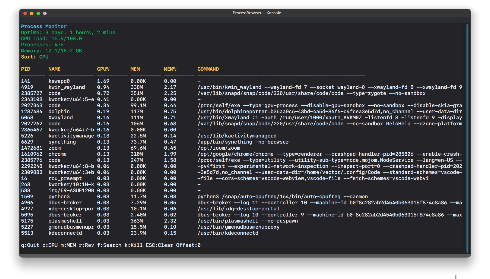

# Process Browser

A system utility that provides a comprehensive view of running processes on a computer. The application displays real-time information about CPU usage, memory consumption, and other relevant metrics for each process, allowing users to monitor system performance, identify resource-intensive tasks, and terminate problematic ones.



## Features

1. Show header and process table 
    - Description
        - Show in Header : 
            - total uptime ( 2 days, 16 hours, 42 mins )
            - total CPU load (56.5/100)
            - amount of memory (11.1/15.6)
        - Show in Table
            - table in format PID,name,cpu usage %,ram_usage(absolute), ram_usage % for each row
            - amount of row = amount of all processes
3. Sort
    - Description
        - Handle user input 
        - press c - toggle sort by cpu
        - press m - toggle sort by mem
4. Kill/search 
    - Description
        - Handle user input 
        - 'f' to search
        - 'k' to kill (SIGINT)
        - [NOT IMPLEMENTED] double 'f' - SIGKILL 
5. Uses ncurses 

## Dependencies

- GCC
- Make
- Ncurses

## Build Instructions

1. Clone the repository:
```bash
git clone https://github.com/ValikProgrammer/ProcessBrowser
cd ProcessBrowser
```

2. Install dependencies (ncurses):
```bash
./third_party_installation.sh
```

3. Build the project:
```bash
make
```

4. Run tests:
```bash
make test
```

5. Run the program:
```bash
./bin/ProcessBrowser
```


## Usage Examples

```bash
./bin/ProcessBrowser  
```

### Control keys

| Key | Action |
|---------|----------|
| `c` | Sorting by CPU |
| `m` | Sorting by memory |
| `r` | Reverse (reverse order) |
| `f` or `F3` | Interactive search |
| `k` or `F9` | Kill the process |
| `↑`/`↓` | Scrolling line by line |
| `PgUp`/`PgDn` | Scroll by 10 lines |
| `q` / `ESC` | Exit |


### Notes

If programm crashed or did something unexpected, you may read logs in `logs/` folder.
